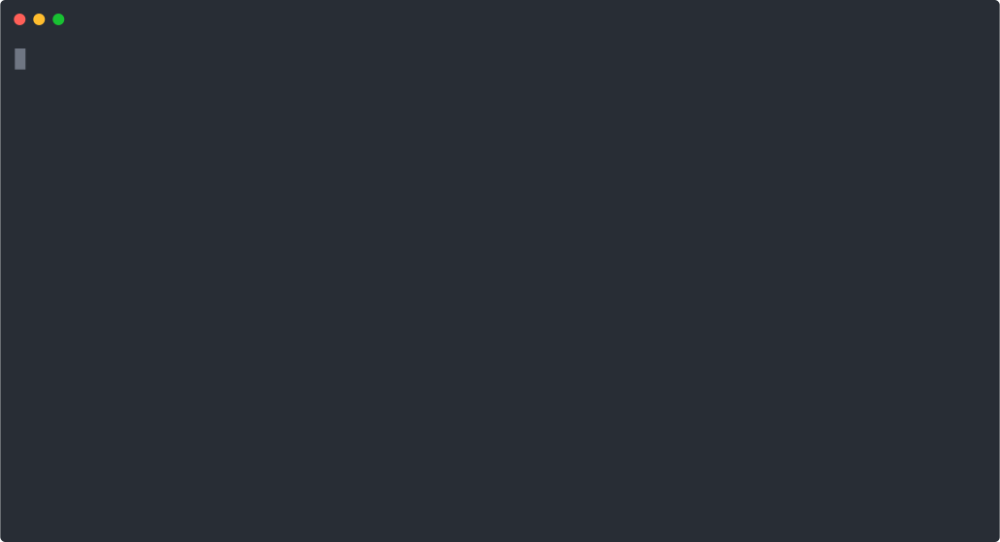

<div align="center">

  
  <h2 align="center">container-use</h2>
  <p align="center">Containerized environments for any coding agent 🤖</p>

  <p align="center">
    
    <a href="https://opensource.org/licenses/Apache-2.0">
      
    </a>
    <a href="https://discord.gg/UhXqKz7SRM">
      
    </a>
  </p>
</div>

<p align='center'>
    
</p>


## Installing

```sh
go build ./cmd/container-use
```

Make sure to put `container-use` in your `$PATH`

## Agent Integration

Enabling `container-use` requires 2 steps:

1. Adding an MCP configuration for `container-use`
2. (Optional) Adding a rule so the agent uses containarized environments.

### Claude Code

```sh
# Add the container-use MCP
npx @anthropic-ai/claude-code mcp add container-use -- <path to container-use> stdio

# Save the CLAUDE.md file at the root of the repository. Alternatively, merge the instructions into your own CLAUDE.md.
curl -o CLAUDE.md https://raw.githubusercontent.com/dagger/container-use/main/rules/agent.md
```

### Goose

Add this to `~/.config/goose/config.yaml`:

```yaml
extensions:
  container-use:
    name: container-use
    type: stdio
    enabled: true
    cmd: container-use
    args:
    - stdio
    envs: []
```

### Cursor

```sh
curl --create-dirs -o .cursor/rules/container-use.mdc https://raw.githubusercontent.com/dagger/container-use/main/rules/cursor.mdc
```

### VSCode / GitHub Copilot

```sh
curl --create-dirs -o .github/copilot-instructions.md https://raw.githubusercontent.com/dagger/container-use/main/rules/agent.md
```

## Examples

| Example | Description |
|---------|-------------|
| [hello_world.md](examples/hello_world.md) | Creates a simple app and runs it, accessible via localhost HTTP URL |
| [parallel.md](examples/parallel.md) | Creates and serves two variations of a hello world app (Flask and FastAPI) on different URLs |
| [security.md](examples/security.md) | Security scanning example that checks for updates/vulnerabilities in the repository, applies updates, verifies builds still work, and generates patch file |

Run with goose:

```console
goose run -i ./examples/security.md -s
```

## Watching your agents work

Your agents will automatically commit to a container-use remote on your local filesystem. You can watch the progress of your agents in real time by running:

```console
container-use watch
```
