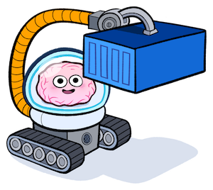

<div align="center">
  
  <h1 align="center">container-use</h2>
  <p align="center">Containerized environments for coding agents. (📦🤖) (📦🤖) (📦🤖)</p>
  <p align="center">
    
    <a href="https://opensource.org/licenses/Apache-2.0">
      
    </a>
    <a href="https://discord.gg/UhXqKz7SRM">
      
    </a>
  </p>
</div>

**Container Use** lets each of your coding agents have their own containerized environment. Go from babysitting one agent at a time to enabling multiple agents to work safely and independently with your preferred stack.

<p align='center'>
    
</p>

It's an open-source MCP server that works as a CLI tool with Claude Code, Cursor, and other MCP-compatible agents.

* 📦 **Isolated Environments**: Each agent gets a fresh container in its own git branch - run multiple agents without conflicts, experiment safely, discard failures instantly.
* 👀 **Real-time Visibility**: See complete command history and logs of what agents actually did, not just what they claim.
* 🚁 **Direct Intervention**: Drop into any agent's terminal to see their state and take control when they get stuck.
* 🎮 **Environment Control**: Standard git workflow - just `git checkout <branch_name>` to review any agent's work.
* 🌎 **Universal Compatibility**: Works with any agent, model, or infrastructure - no vendor lock-in.

---

🦺 This project is in early development and actively evolving. Expect rough edges, breaking changes, and incomplete documentation. But also expect rapid iteration and responsiveness to feedback.

---

## Install

First install [Docker](https://docs.docker.com/get-started/get-docker/), then clone this repository:

```sh
git clone https://github.com/dagger/container-use.git
cd container-use
```

Install the `cu` binary:

```sh
make install && hash -r
```

The `make install` command will put `cu` in your `$PATH`. In order to use it, you will need to restart your terminal or run `hash -r` to refresh your `$PATH` (or equivalent for your shell).

## Building

To build the `cu` binary without installing it to your `$PATH`:

```sh
make
```

The build uses the platform you are on by default. If you need to cross-compile you can use the `TARGETPLATFORM` environment variables. For example `TARGETPLATFORM=linux/arm64 make` to build for Raspberry Pi
or `TARGETPLATFORM=darwin/arm64 make` to build for macOS Apple Silicon.

## Integrate Agents

Enabling `container-use` requires 2 steps:

1. Adding an MCP configuration for `container-use`
2. (Optional) Adding a rule so the agent uses containarized environments.

### [Claude Code](https://docs.anthropic.com/en/docs/claude-code/tutorials#set-up-model-context-protocol-mcp)

Add the container-use MCP:

```sh
npx @anthropic-ai/claude-code mcp add container-use -- <path to cu> stdio
```

Save the CLAUDE.md file at the root of the repository. Alternatively, merge the instructions into your own CLAUDE.md.

```sh
curl -o CLAUDE.md https://raw.githubusercontent.com/dagger/container-use/main/rules/agent.md
```

### [goose](https://block.github.io/goose/docs/getting-started/using-extensions#mcp-servers)

Add this to `~/.config/goose/config.yaml`:

```yaml
extensions:
  container-use:
    name: container-use
    type: stdio
    enabled: true
    cmd: cu
    args:
    - stdio
    envs: {}
```

### [Cursor](https://docs.cursor.com/context/model-context-protocol)

```sh
curl --create-dirs -o .cursor/rules/container-use.mdc https://raw.githubusercontent.com/dagger/container-use/main/rules/cursor.mdc
```

### [VSCode](https://code.visualstudio.com/docs/copilot/chat/mcp-servers) / [GitHub Copilot](https://docs.github.com/en/copilot/customizing-copilot/extending-copilot-chat-with-mcp)

The result of the instructions above will be to update your VSCode settings with something that looks like this:

```json
    "mcp": {
        "servers": {
            "container-use": {
                "type": "stdio",
                "command": "cu",
                "args": [
                    "stdio"
                ]
            }
        }
    }
```

Once the MCP server is running, you can optionally) update the instructions for copilot using the following:

```sh
curl --create-dirs -o .github/copilot-instructions.md https://raw.githubusercontent.com/dagger/container-use/main/rules/agent.md
```

### [Kilo Code](https://kilocode.ai/docs/features/mcp/using-mcp-in-kilo-code)

`Kilo Code` allows setting MCP servers at the global or project level.

```json
{
  "mcpServers": {
    "container-use": {
      "command": "replace with pathname of cu",
      "args": [
        "stdio"
      ],
      "env": {},
      "alwaysAllow": [],
      "disabled": false
    }
  }
}
```

## Examples

| Example | Description |
|---------|-------------|
| [hello_world.md](examples/hello_world.md) | Creates a simple app and runs it, accessible via localhost HTTP URL |
| [parallel.md](examples/parallel.md) | Creates and serves two variations of a hello world app (Flask and FastAPI) on different URLs |
| [security.md](examples/security.md) | Security scanning example that checks for updates/vulnerabilities in the repository, applies updates, verifies builds still work, and generates patch file |

### Run with [Claude Code](https://www.anthropic.com/claude-code)

```console
cat ./examples/hello_world.md | claude --dangerously-skip-permissions
```

### Run with [goose](https://block.github.io/goose/)

```console
goose run -i ./examples/hello_world.md -s
```

### Run with [Kilo Code](https://kilocode.ai/) in `vscode`

Prompt as in `parallel.md` but added a sentence 'use container-use mcp'

<p align='center'>
    
</p>

## Watch your agents work

Your agents will automatically commit to a container-use remote on your local filesystem. You can watch the progress of your agents in real time by running:

```console
cu watch
```
